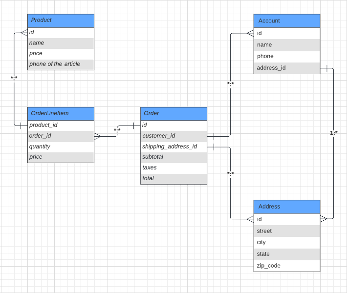
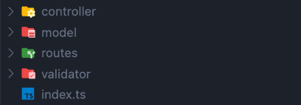

# Simple MVC backend for store "MVP product"

This repository contains the backend MVC implementation of a store API.

## Hightlights

1. Express.js with Typescript
2. TypeORM with Sqlite for DB handling
3. MVC Feature-oriented architecture
4. Error validation

## Installation

In the project root folder, run:
```bash
yarn install
```

## Run project

In the project root folder, run:
```bash
yarn run dev
```

This will start a server at http://localhost:9000, so please ensure this port is available.

## Project details

### Database



#### SQLite

For the simplicity of the project, it was used sqlite database, so it's easier to test and share. 
The configuration file is inside `src/core/database`.

```ts
const AppDataSource = new DataSource({
  type: "sqlite",
  database: "./database.sqlite",
  entities: [Address, Account,Product, Order, OrderLineItem],
  // logging: true,
  // Synchronize schema with database
  // Use in development or on first run only; may result in data loss!
  synchronize: true 
});
```

If you would like to connect to a different DB, you could do it just changing the config file.

### Folder Structure

It was used an MVC architecture with an feature-oriented approach. Inside `app` we can find the different app features that we handle.



The main idea is to separate as much as possible the logic of this features and make code easier to debug in case of errors.


